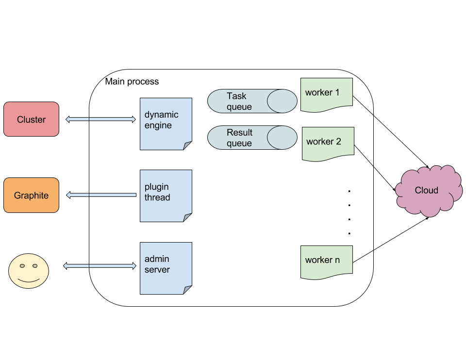
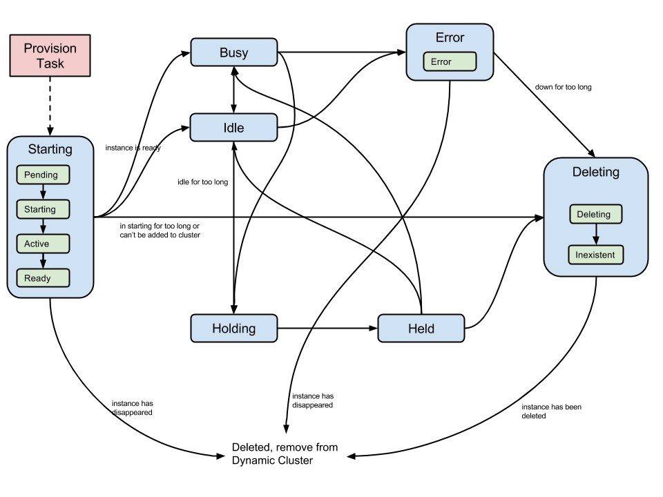

# Design

## System architecture

Dynamic Cluster runs a main process and a number of worker processes.

The main process has a query thread, an admin server thread and plugin thread(s).

The query thread queries the cluster and generates cloud tasks. It then puts the tasks into a task queue.

The worker processes consume the task queue and run tasks. These tasks are to communicate with the cloud system to start/delete instances or get instance states, etc. Then worker processes put results into the result queue.

The query thread consumes the result queue and acts on the results, such as modifying the cluster (add or delete nodes) or generating another task.

Each plugin starts a thread. For example, the graphite plugin thread sends messages to an external Graphite server.

The admin server runs on a lightweight HTTP server [bottlepy](http://bottlepy.org/docs/dev/index.html) that serves Restful API and the dashboard.

## States

Each *worker node* in Dynamic Cluster has eight states:

* Inexistent: the worker node doesn't exist, it is either the beginning of the life cycle of a worker node or the end of it. 
* Starting: the worker node is starting, including the cloud starting the instance and contextualisation after startup. 
* Idle: the worker node is idle in the cluster
* Busy: the worker node is running jobs
* Error: the worker node is abnormal
* Deleting: deleting the worker node
* Holding: a request has been sent to hold the worker node but it is not held yet
* Held: the worker node is held, or disabled

The states are the key of the system. They provide a generic mapping to different clusters, and the interaction with the cluster and the cloud are based on the transition of states.

