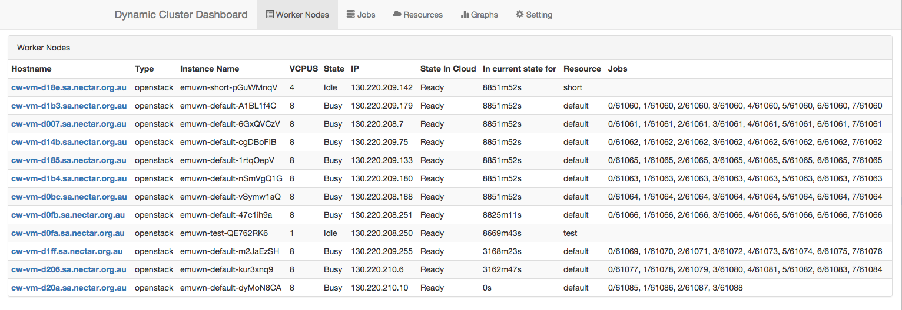
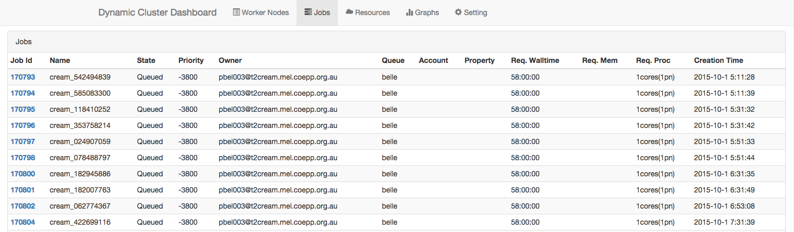
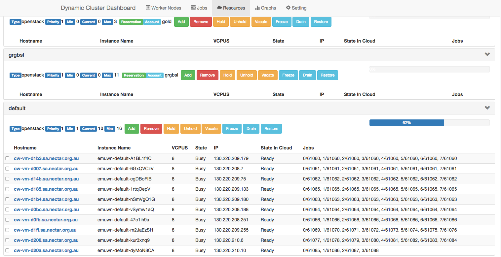
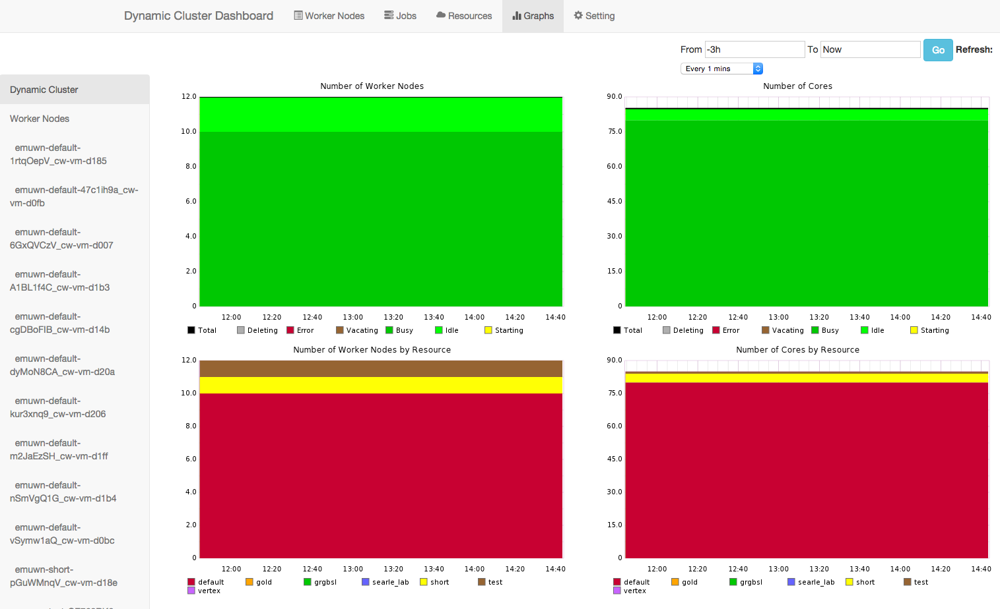
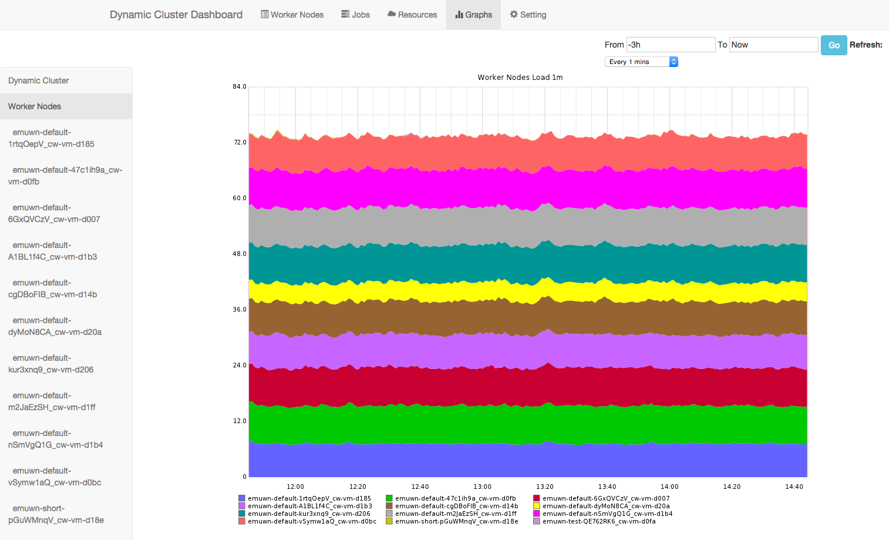
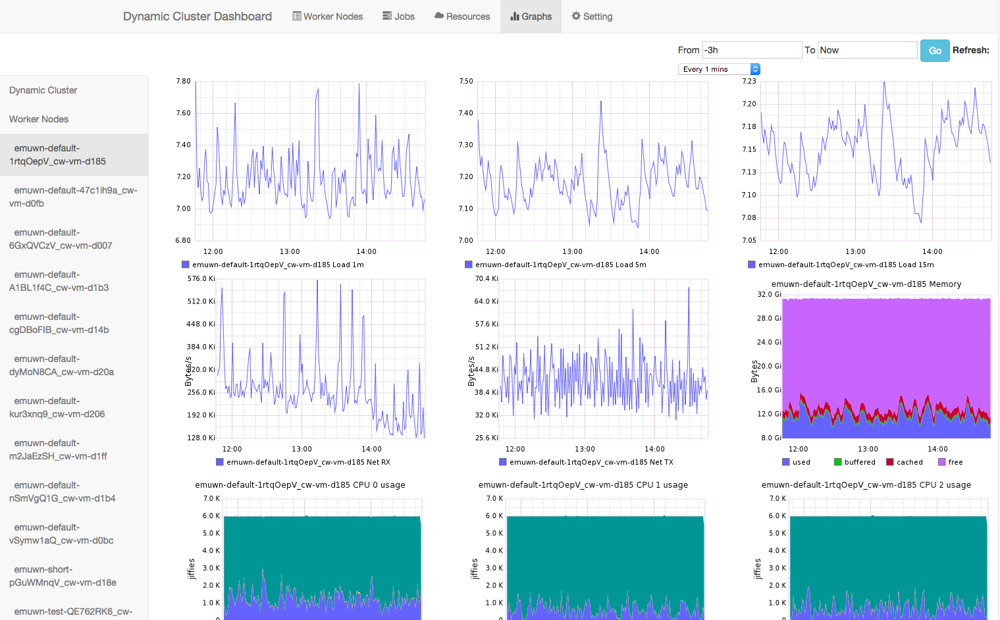
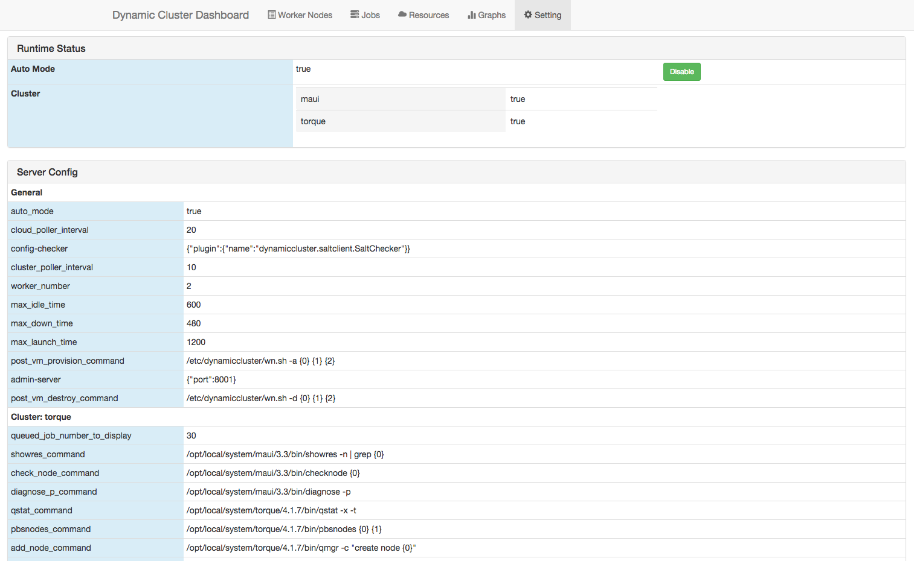

# Usage

Users (admins) interact with Dynamic Cluster via its Restful interface.

To make things easier, a web-based dashboard is provided. A CLI may be available in future releases.

If you want to integrate Dynamic Cluster into your program/script, please see the details in [Restful API](/restapi.html).

## Dashboard

The dashboard includes five views:

* Worker nodes view
* Jobs view
* Resource view
* Graph view
* Setting view

### Worker nodes view

Worker nodes view shows the information of all worker nodes. Clicking the hostname of the node brings up a detail dialog.

### Jobs view

Jobs view shows pending jobs. The number of jobs is defined in config, cluster -> config -> queued_job_number_to_display. Clicking the id of the job brings up a detail dialog.

### Resource view

This is the most important view where you can manipulate your resources. Other views are mostly informative.

Each resource is in a box that can collapse.

Each box has several things:

* name of the resource
* priority of the resource
* minimum and maximum number of worker nodes
* reservations
* current number of worker nodes and the list of these worker nodes
* a number of buttons that can change the state of the resource or worker node(s)
  * Add: add new worker node(s) to the resource
  * Remove: delete worker node(s), select worker node(s) with check box. A worker node can be deleted when it is in _Held_, _Starting_, _Error_.
  * Hold: hold worker node(s), so that they can't accept more jobs, running jobs will continue to run
  * Unhold: unhold worker node(s), so that they can accept more jobs.
  * Vacate: vacate worker node(s), which will delete all running jobs on the worker node(s).
  * Freeze: freeze a resource, no new worker node will be launched and no current worker node will be removed automatically.
  * Drain: clean up all worker nodes in a resource. It will hold all worker nodes and wait for all running jobs to finish, then delete all worker nodes.
  * Restore: restore a resource back to normal state, so that it can grow and shrink according to config automatically.
  
### Graph view

Graph view shows the usage of Dynamic Cluster and stats of worker nodes.

Its data is from [Graphite](http://graphite.wikidot.com/), and the [graphite plugin](/deploy.html#plugin-section) must be enabled.

It has a toolbar which can select the start time and end time to render the charts, and the refresh interval.

On the left there is a menu that can switch from Dynamic Cluster view to worker nodes overview, and individual worker node's view.

The Dynamic Cluster view shows the usage of Dynamic Cluster, including the total number of worker nodes and the total number of cores, as well as the number by resources.

The Worker nodes overview shows the aggregation view of all worker nodes. It has four charts:

* load 1m
* memory used
* network rx/tx
* vda read/write

Individual worker node view shows more details:

* load 1m, 5m 15m
* memory used, buffered, cached, free
* network rx/tx of all interfaces except lo
* all disks read/write
* usage of each cpu

### Setting view

Setting view shows the status of Dynamic cluster and its config file.

You can set/unset automatic mode here and see the status of local cluster (torque/maui or SGE).
